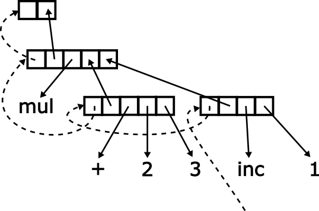

<style>
div.twocols {
  margin-top: 35px;
  column-count: 2;
}
div.twocols p:first-child,
div.twocols h1:first-child,
div.twocols h2:first-child,
div.twocols ul:first-child,
div.twocols ul li:first-child,
div.twocols ul li p:first-child {
  margin-top: 0 !important;
}
div.twocols p.break {
  break-before: column;
  margin-top: 0;
}
</style>


# The Egel Language

_semantics, the language, current state, future goals_

M.C.A. (Marco) Devillers, January 2024

---

# The Egel Language

Egel is an untyped concurrent functional scripting language based on eager combinator rewriting

Primarily about exploring and exploiting a trivialized operational model

---

# A term graph (math)


Q: design a machine that evaluates terms like the above?

---

# Solution space

An abstract assembly language (LISP)

A variation of a lambda evaluator à la SECD or CAM (OCaml)

A combinator machine (Miranda)

A graph reduction machine (Haskell, Clean)

*Or a bit of all of the above*

----

# A term graph (computer)


----

# Twist the term graph

<div class="twocols">



<p class="break"></p>

Link all redexes with
1. what redex to reduce next
2. where to place the reduction

</div>

----

# Directed Acyclic Graph


----

# Evaluation (a)

<div class="twocols">


<p class="break"></p>


</div>

----

# Evaluation (b)

<div class="twocols">


<p class="break"></p>


</div>

---

# Evaluation (c)

<div class="twocols">


<p class="break"></p>


</div>

---

# Evaluation (d)

`fac n = n * fac (n - 1)`

<div class="twocols">


<p class="break"></p>


</div>

---

# Control flow, extending with handlers

`try 1 + throw 42 catch (\x. x)`

<div class="twocols">


<p class="break"></p>

Facilitate exceptional control flow with pointers to handlers 

Still a directed acyclic graph

</div>

---

# Concurrency, multiple roots

<div class="twocols">


<p class="break"></p>

Multiple roots gives parallelism or concurrency

</div>

---

# The semantics

An operational model where reduction can be expressed as trampolining the apex of a directed acyclic graph

This is a _trivialization_ of a number of operational models, nothing really new but _clarifies_

A number of advantages:

1. Can be implemented with reference counting
2. Rewriting so less need for tail-call optimization
3. Programs can be halted and serialized or shipped at any moment
4. Can easily be extended to support complex control flow and concurrency
5. Out-of-scope is immediate collection
6. Collection can support finalizers

---

# The Egel Language

A bare-bones frontend to the previous operational model

Untyped to be able to maximally explore that model

Roughly, a rewriter for a small lambda calculus with constants

---

# Primitives

Integers, floats, Unicode characters and strings

```
    42, 3.14, 'a', "Hello world!"
```

Constants compose

```
    0 1, cons 'a' nil
```

---

# The anonymous pattern matching rewrite

The work horse of Egel programs are pattern matching rewrites

```
    [X -> X],  [0 -> "zero" | 1 -> "one | X -> "too much"]
```

A rewrite can be any arity

```
    [ X Y -> "two" | X -> "one" | -> "zero" ]
```

Let binds variables
```
    let {X,Y} = {41, 1} in X + Y
```

---

# Constants and combinators

```
    data leaf, branch
```

```
    def tree_size = 
        [ leaf -> 0 | (branch _ T0 T1) -> 1 + tree_size T0 + tree_size T1 ]
```

---

# Syntactic sugar

Tuples 

```
    (42, 3.14) == (tuple 42 3.14)
```

Lists

```
    {} == nil,
    {1,2} == cons 1 (cons 2 nil)
    {1|f 42} == cons 1 (f 42)
```

---

# Exceptions and parallelism

Try/catch statements

```
    try 1 + throw 42 catch [X -> X]
```

Async/await for parallelism

```
    let F = async [_ -> f 42] in await F
```

---

# Namespaces and modules

```
import "prelude.eg"

namespace Fibonacci (
    using System
  
    def fib =
        [ 0 -> 1
        | 1 -> 1
        | N -> fib (N - 2) + fib (N - 1) ]
)

using Fibonacci

def main = fib 5
```

---

# Various

Mutable reference objects and mutable dictionaries for speed

Literate programming in markdown files

Various libraries for:
    - input/output
    - regular expressions
    - remote execution of programs
    - a Python bridge

---

# The Egel interpreter

Implemented on top of C++ with utter disregard for performance
- no garbage collector but native reference counting
- combinators form a complex object oriented hierarchy
- for the moment, header-only library

REPL, batch, command execution

A useful toy for short programs or programming language exploration

Sluggish and unpolished experience...

---

# Future goals

1. Make the Egel interpreter user-friendly
2. Show the model can be performant with a typed backend

